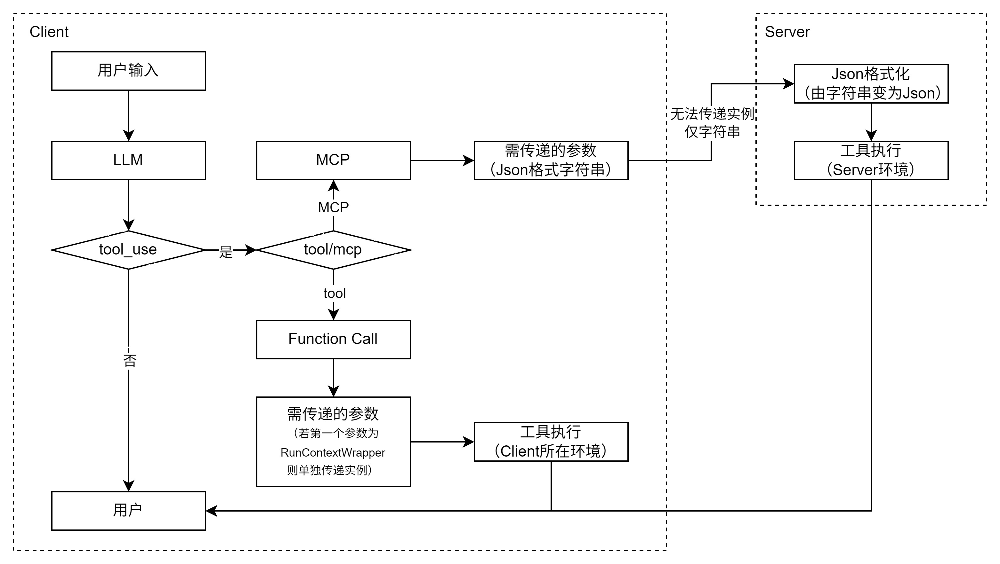

# Function Calling与MCP
## 架构
Function Calling与MCP的架构如下所示：
<div align=center></div> 

两者区别：
1. function calling在agent运行环境执行，可以访问到当前环境的变量，可以直接向调用函数传递实例。
2. MCP在Server环境中执行，只能接收传递的字符串型数据，json化转换成字典形式传递给工具。

## 数据传递的问题
当Agent工作流程中，会涉及一些不需要让大模型知道的信息。

例如以下工作流程：

1. 读取数据
2. 删除缺失数据

按照标准的工具调用，只要是读取与删除缺失数据是两个工具，就涉及参数的传递（不论是function call还是MCP）,参数传递流程为：

1. 文件路径传递给工具：文件路径{"path": "./data.csv"} -> 读取数据工具
2. 工具返回数据： 读取数据工具 -> 原始数据{"data": ...}
3. 数据传递给工具： 原始数据{"data": ...} -> 删除缺失数据工具
4. 工具返回数据： 删除缺失数据工具 -> 处理后数据{"data": ...}

在这个流程中，大模型不需要知道数据的具体内容，它只需要知道读取了数据，并完成了清洗。如果将数据传递给大模型会涉及两个问题:

1. 大模型具有输入输出长度的限值，如果数据非常大，会导致突破上限，并增加token数，增加计算时间
2. 大模型是一个概率模型，将数据作为文本传递无法保证数据的正确性和一致性
3. 部分非结构性数据无法用文本表示

## OpenAI-Agents-SDK的解决方式

OpenAI-Agents-SDK中设置了一种在agent运行过程中用于保存中间结果的`context`，即隐式上下文。将大模型不需要知道的内容保存在context中。\
以下是一个例子：

1. 定义了一个上下文类型用于缓存数据
```python
@dataclass
class Data:
    data: Any

# 实例化
data = Data(data=None)

# print结果
# Data(data=None)
```

2. 定义了一个读取数据的tool
```python
from agents import function_tool, RunContextWrapper
# function_tool是从agents库中调用的，因此只有agents框架可以传入context，其他框架有其他的方法。

@function_tool
async def extract_data(
    context: RunContextWrapper,    # 隐式参数： 不写进Json Schema
    file_path: str                 # 显式参数： 写进Json Schema
):
    """
    读取指定路径的数据
    :param file_path: 文件路径
    """
    df = pd.read_csv(file_path)
    context.context.data = df
    return f'已从{file_path}读取数据'
```
功能为：读取指定路径, context作为隐式参数不写进Json Schema，大模型不知道该函数具有这个参数

3. 构建一个可以调用`extract_data`的Agent
```python
agent1 = Agent(
    name="Extractor",
    instructions="根据用户需求，从指定路径或数据库提取数据",
    tools=[extract_data],
    model=model
)
```

`agent1`是专门用于提取数据的agent, 可以使用工具`extract_data`,即`2.`中定义的函数。

4. 让`agent1`读取本地文件`data.csv`, 并将`1.`中实例化的`data`作为上下文`context`。
```python
result = await Runner.run(
    starting_agent=agent1,
    input='读取test.csv',
    context=data
)
```
5. 从大模型的消息列表中发现，并没有获得具体的数据
```json
[
// 用户输入
  { 
    "content": "读取test.csv",                      
    "role": "user"
  },
// 这里没有传递extract_data的参数`context`，因为`from agents import function_tool`会将该参数打包为`RunContextWrapper`
// 工具调用参数
  {
    "arguments": "{\"file_path\":\"test.csv\"}",
    "call_id": "call_yl4mefl7",
    "name": "extract_data",
    "type": "function_call",
    "id": "__fake_id__"
  },
// 工具调用返回结果
  { # 
    "call_id": "call_yl4mefl7",
    "output": "已从test.csv读取数据",                
    "type": "function_call_output"
  },
// 工具调用结束后大模型的返回
  { 
    "id": "__fake_id__",
    "content": [
      {
        "annotations": [],
        "text": "<think>\n好的，用户让我读取test.csv文件，我需要先确认这个文件的位置。通常，如果用户没有指定具体路径，可能默认是在当前工作目录下。我需要调用extract_data函数，参数是file_path为\"test.csv\"。然后系统会处理读取操作，返回结果。用户可能接下来需要查看数据内容或者进行进一步的分析，我应该准备好后续步骤。不过现在只需要确认文件是否成功读取，如果有错误可能需要处理异常，但根据回复显示已成功读取，所以下一步可以询问用户是否需要查看数据或进行其他操作。\n</think>\n\n已成功从test.csv读取数据。您是否需要查看数据内容或进行进一步的操作？",
        "type": "output_text"
      }
    ],
    "role": "assistant",
    "status": "completed",
    "type": "message"
  }
]
```

读取后的数据保存在：`4.`中作为context参数输入的`data`中。
<center>

</center>

### 处理逻辑

1. 首先，在`function_schema`函数中检测和处理`RunContextWrapper`参数：

```python
# ========== 逻辑关键点 ==========
# 检查第一个参数是否为RunContextWrapper
if params:
    first_name, first_param = params[0]
    # 获取类型注解
    ann = type_hints.get(first_name, first_param.annotation)
    if ann != inspect._empty:
        origin = get_origin(ann) or ann
        if origin is RunContextWrapper:
            takes_context = True  # 标记函数需要上下文
        else:
            filtered_params.append((first_name, first_param))
    else:
        filtered_params.append((first_name, first_param))

# 检查其他参数，如果包含RunContextWrapper则报错
for name, param in params[1:]:
    ann = type_hints.get(name, param.annotation)
    if ann != inspect._empty:
        origin = get_origin(ann) or ann
        if origin is RunContextWrapper:
            raise UserError(
                f"RunContextWrapper param found at non-first position in function"
                f" {func.__name__}"
            )
    filtered_params.append((name, param))
```

2. 在`_on_invoke_tool_impl`函数中处理函数调用：

```python
async def _on_invoke_tool_impl(ctx: RunContextWrapper[Any], input: str) -> Any:
    try:
        # 解析JSON输入
        json_data: dict[str, Any] = json.loads(input) if input else {}
    except Exception as e:
        if _debug.DONT_LOG_TOOL_DATA:
            logger.debug(f"Invalid JSON input for tool {schema.name}")
        else:
            logger.debug(f"Invalid JSON input for tool {schema.name}: {input}")
        raise ModelBehaviorError(
            f"Invalid JSON input for tool {schema.name}: {input}"
        ) from e

    try:
        # 使用Pydantic模型验证参数
        parsed = (
            schema.params_pydantic_model(**json_data)
            if json_data
            else schema.params_pydantic_model()
        )
    except ValidationError as e:
        raise ModelBehaviorError(f"Invalid JSON input for tool {schema.name}: {e}") from e

    # 获取函数调用参数
    args, kwargs_dict = schema.to_call_args(parsed)

    # 根据函数类型和是否需要上下文来决定调用方式
    if inspect.iscoroutinefunction(the_func):
        # ========== 逻辑关键点 ==========
        if schema.takes_context:
            result = await the_func(ctx, *args, **kwargs_dict)
        else:
            result = await the_func(*args, **kwargs_dict)
    else:
        if schema.takes_context:
            result = the_func(ctx, *args, **kwargs_dict)
        else:
            result = the_func(*args, **kwargs_dict)

    return result
```

主要处理流程是：

1. 首先检查函数参数，确保`RunContextWrapper`只能作为第一个参数
2. 解析输入的JSON数据并验证参数
3. 根据函数类型（同步/异步）和是否需要上下文来决定调用方式
4. 如果发生错误，使用错误处理函数处理异常

这个设计允许工具函数以统一的方式处理上下文参数，同时保持了代码的灵活性和可维护性。


## MCP无法解决隐式上下文的问题
agents能在Function Calling函数中传入实例化的`context`是由于在框架中进行了处理，当函数第一个参数的类型是`RunContextWrapper`时，自动截获该参数。而MCP架构中没有这一步的处理。

由于MCP的架构是客户端与服务器分离的，也就是说当前agent所在的环境和运行工具的服务器是隔离的，agent的上下文`context`无法传递给服务器，
服务器能够接受的只有json格式的参数，而json格式的参数是无法保留实例的，只能作为一个字符串。
因此，当MCP工具加入`context`参数时，仍然会把`context`作为一个需要大模型传递的参数，即显式参数。


## 总结

1. 当涉及隐式上下文时，需要在当前环境中运行访问自定义的`RunContextWrapper`, 此时函数自由度低且需传入实例, 无法自由复用，应当使用Function Calling。
2. 当不涉及隐式上下文，高度复用场景，例如联网检索、RAG、文件操作、获取信息等，应该使用MCP，方便复用。