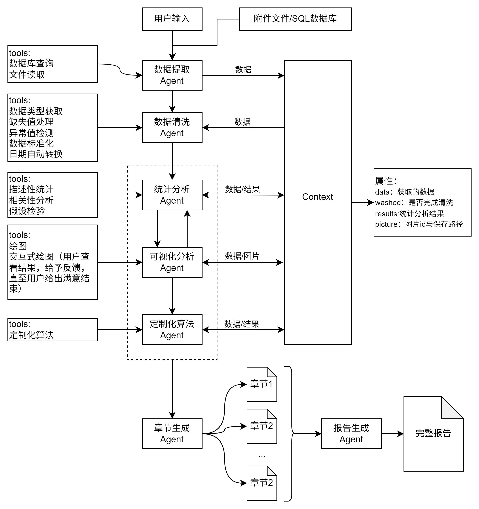

# 数据分析Agent架构
整体架构由以下模块组成：
- [数据提取Agent](#数据提取agent)
- [数据清洗Agent](#数据清洗agent)
- [统计分析Agent](#统计分析agent)
- [可视化分析Agent](#可视化分析agent)
- [自定义算法Agent](#自定义算法agent)
- [报告生成Agent](#报告生成agent)
- [MySQL数据库](#mysql数据库)


## 数据提取Agent
数据提取agent用于读取用户需要的数据
- 用户输入文件路径
- 用户输入数据要求，从MySQL数据库读取

- 保存至`context`中的`data`字段

### data类：
value: 用于存储数据信息\
washed: 用于识别是否清洗，只有清洗过的数据才能进行分析 
```json
{
    "value": "数据",
    "washed": False
}
```

提取完数据后转接给数据清洗agent

## 数据清洗Agent

数据清洗agent用于清洗数据，顺序实现以下功能：
- 数据类型获取：变量名，数据样例
- 缺失值处理：剔除、填充
- 异常值检测
- 数据类型转换：如果是时间且是字符串，转换为datatime类型，因缺失值导致的object型转化为数值型
- 数据标准化：默认为False

数据清洗完成后，`context`中`data`的`washed`设置为`True`,可以进行分析。Agent转接给统计分析agent。

## 统计分析Agent

对变量进行统计分析：
- 描述性分析：进行描述性分析，绘制直方图、饼图、柱状图等。
- 相关性分析：Pearson相关性分析等
- 假设检验

统计分析结果保存至`context`中的`result`

### result类
```json
{
    "id": {
        "variable": "分析的变量",
        "result": "分析结果"
    }
}
```
统计分析完成后，agent转接给自定义算法Agent。

## 可视化分析Agent

可视化分析agent作为一个工具使用，当其他agent要绘制统计图时转接给可视化分析agent，当绘制完成后，转接回原来的agent。实现两个工具：
- 绘图：一次绘图，完成后结束
- 可交互式绘图：绘图完成后，用户可以给予反馈，对绘图进行修改，例如修改颜色、字号等。

绘图完成后保存至`context`中的`pictures`。
### picture
```json
{
    "id": {
        "file_path": "图片路径",
        "description": "图片描述"
    }
}
```
## 自定义算法Agent
执行编写的算法，如决策树算法等。分析结果同样存储在`context`的`results`中。

自定义算法完成后，完成该轮对话。

## 章节生成Agent
统计分析agent与自定义算法agent完成分析后，转接给章节生产agent，生成该章节的内容。

## 报告生成Agent
当所有分析完成、章节生成完成后，将所有章节内容输入给报告生成Agent，生成完整报告。

## 框架结构图


